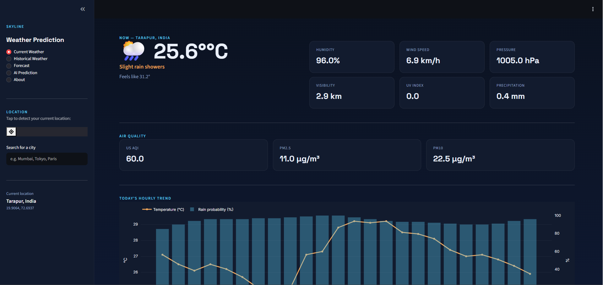
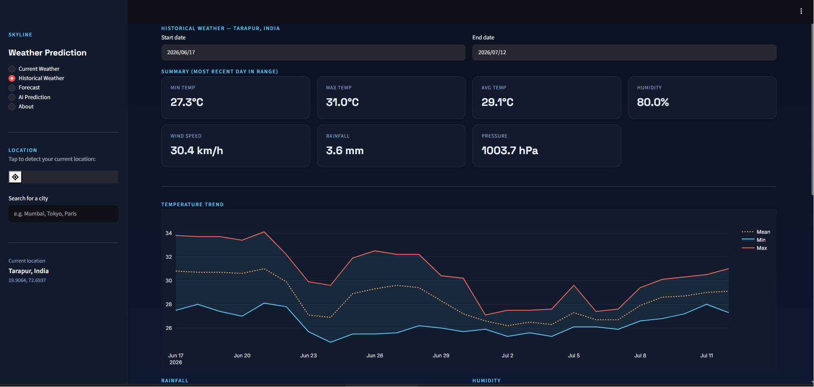

# 🌦️ Skyline — Weather Prediction Web Application

A production-ready, full-stack weather dashboard built in Python with **Streamlit**,
**Plotly**, and a custom **LSTM neural network** for AI-based temperature prediction.
Detect your location by GPS or search any city, then explore current conditions,
historical records, multi-day forecasts, and an AI-generated temperature prediction —
all in one modern, responsive dashboard.

[](#)
[](#)
[](LICENSE)

🚀 **[Live Demo Link (Streamlit Community Cloud)](https://weather-prediction-bxlk.onrender.com/)** *(Deploy yours for free on Streamlit!)*

> [!NOTE]
> **Python 3.14 Compatibility**: TensorFlow does not currently support Python 3.14 pre-built wheels. This app features a robust fallback mechanism: if TensorFlow is not installed, `train_model.py` automatically trains a Scikit-Learn `RandomForestRegressor` and the app runs in fallback mode without crashing.

---

## ✨ Features

| Area | What it does |
|---|---|
| 📍 **Location** | GPS auto-detection (browser geolocation) or manual city search with autocomplete-style matching |
| 🌡️ **Current Weather** | Temperature, feels-like, humidity, wind, pressure, visibility, UV index, air quality, hourly trend chart |
| 📜 **Historical Weather** | Pick any past date range and see min/max/avg temp, humidity, wind, rainfall, pressure, sunrise/sunset, monthly averages, and a correlation heatmap |
| 🔮 **Forecast** | Up to 16 days ahead: daily cards, temperature/rain-probability trend, 48-hour hourly detail |
| 🤖 **AI Prediction** | A trained LSTM model predicts tomorrow's mean temperature from the last 14 days of patterns |
| 📊 **Visualizations** | All charts built with Plotly for interactivity (zoom, hover, pan) |
| 🎨 **UI** | Custom dark "storm-to-clear-sky" theme, sidebar navigation, responsive layout |

---

## 🗂️ Project Structure

```
weather_prediction/
│
├── app.py              # Main Streamlit dashboard (entry point)
├── model.py             # LSTM architecture, training/eval/inference helpers
├── train_model.py        # Standalone script: fetch data → train → save model
├── preprocess.py          # Cleaning, feature engineering, scaling, sequencing
├── utils.py              # API calls (Open-Meteo), geocoding, formatting helpers
├── requirements.txt
├── README.md
├── data/                # Cached/exported CSVs (generated, gitignored)
├── models/               # Saved model.h5 + scaler.joblib (generated, gitignored)
├── notebooks/
│   └── data_exploration.ipynb
├── assets/               # Screenshots, static images
└── .gitignore
```

---

## 🧰 Tech Stack

- **Frontend**: Streamlit, custom CSS, Plotly
- **Backend / ML**: Python, Pandas, NumPy, Scikit-learn, TensorFlow (Keras LSTM), Joblib
- **APIs**: [Open-Meteo](https://open-meteo.com/) (forecast, archive, air quality, geocoding) — free, no API key required
- **Geocoding**: Geopy (Nominatim) for reverse geocoding of GPS coordinates

---

## 🚀 Installation

### 1. Clone and set up a virtual environment

```bash
git clone <your-repo-url>
cd weather_prediction
python -m venv venv
source venv/bin/activate      # Windows: venv\Scripts\activate
```

### 2. Install dependencies

```bash
pip install -r requirements.txt
```

> **Note on TensorFlow**: if you're on Apple Silicon, you may prefer
> `tensorflow-macos` + `tensorflow-metal` instead of the standard `tensorflow`
> package. Swap the line in `requirements.txt` accordingly.

### 3. (Optional but recommended) Train the AI model

The "AI Prediction" tab needs a trained model. Train one for your location of interest:

```bash
python train_model.py --lat 28.6139 --lon 77.2090 --years 5
```

This fetches 5 years of historical data for the given coordinates, cleans and
engineers features, trains the LSTM with early stopping, and saves:
- `models/lstm_weather_model.h5`
- `models/scaler.joblib`
- `data/historical_weather.csv`

It also prints RMSE, MAE, and R² on a held-out test split.

**Optional arguments:**

| Flag | Default | Description |
|---|---|---|
| `--lat` | `28.6139` | Latitude of training location |
| `--lon` | `77.2090` | Longitude of training location |
| `--years` | `5` | Years of historical data to fetch |
| `--lookback` | `14` | Days of history used to predict the next day |
| `--epochs` | `100` | Max training epochs (early stopping may end sooner) |
| `--batch-size` | `16` | Training batch size |

### 4. Run the app

```bash
streamlit run app.py
```

Open the URL Streamlit prints (typically `http://localhost:8501`).

---

## ☁️ Deployment (Streamlit Cloud)

1. Push this folder to a GitHub repository (the `.gitignore` already excludes
   generated model/data files, so the repo stays lightweight).
2. Go to [share.streamlit.io](https://share.streamlit.io), sign in with GitHub.
3. Click **"New app"**, select your repo, branch, and set the main file path to `app.py`.
4. Deploy. Streamlit Cloud installs everything from `requirements.txt` automatically.
5. If you want AI Prediction to work out of the box, either:
   - Train the model locally and commit `models/*.h5` + `models/*.joblib` (remove
     those lines from `.gitignore` first), or
   - Add a startup step that runs `train_model.py` on first launch (note: this
     will slow down cold starts).

**Browser GPS note**: Streamlit Cloud serves apps over HTTPS, so the browser
geolocation prompt (via `streamlit-geolocation`) will work correctly. Localhost
also works since browsers treat `localhost` as a secure context.

---

## 📖 API Documentation (data sources used)

All weather data comes from **Open-Meteo**, chosen because it's free and requires
no API key:

- **Forecast API** — `https://api.open-meteo.com/v1/forecast` — current conditions, hourly, and daily forecast
- **Archive API** — `https://archive-api.open-meteo.com/v1/archive` — historical daily records
- **Air Quality API** — `https://air-quality-api.open-meteo.com/v1/air-quality` — AQI, PM2.5, PM10
- **Geocoding API** — `https://geocoding-api.open-meteo.com/v1/search` — city name search

Reverse geocoding (lat/lon → place name) uses **Nominatim** via Geopy.

> OpenWeatherMap support can be added as a secondary source — pass an API key
> via `st.secrets["OWM_API_KEY"]` and extend `utils.py` with an equivalent
> wrapper function if you want a fallback provider.

---

## 🧪 Model Evaluation

After training, `train_model.py` reports:

- **RMSE** (Root Mean Squared Error) — average prediction error in °C, penalizing large misses
- **MAE** (Mean Absolute Error) — average absolute error in °C
- **R²** (coefficient of determination) — how much temperature variance the model explains

Expect modest accuracy from a single-location model trained on a few years of
data — this project is built to be educational and extensible, not a
replacement for professional meteorological forecasting.

---

## 🖼️ Screenshots

Below are mock screenshots showing the premium Skyline Weather dashboard design and interface:

### 1. Home / Current Weather Page


### 2. AI Prediction Tab (Running in Fallback Mode)


---

## 🛣️ Future Improvements

- Multi-location model training (currently one LSTM per location; a shared model across many cities would generalize better)
- Add OpenWeatherMap as a live fallback data source
- Cache historical data to disk/SQLite to reduce repeated API calls
- Add precipitation-type classification (rain vs snow) as a separate model output
- User accounts to save favorite locations
- Push notifications / email alerts for severe weather
- Dockerfile for containerized deployment

---

## 🩹 Troubleshooting

| Issue | Fix |
|---|---|
| `ImportError: streamlit_geolocation` | Run `pip install streamlit-geolocation`; GPS button will be hidden if not installed, app still works via city search |
| AI Prediction tab shows "no trained model" | Run `python train_model.py` first (see step 3 above) |
| Historical/Forecast page shows an error | Open-Meteo may be temporarily unreachable, or you're offline — check your network settings |
| TensorFlow install issues | Ensure Python 3.9–3.11; consult [tensorflow.org/install](https://www.tensorflow.org/install) for platform-specific packages |

---

## 📜 License

MIT — feel free to use, modify, and deploy this project for personal or commercial purposes.


<!-- streamlit run app.py 
to run the project-->
# Weather-Prediction-System

